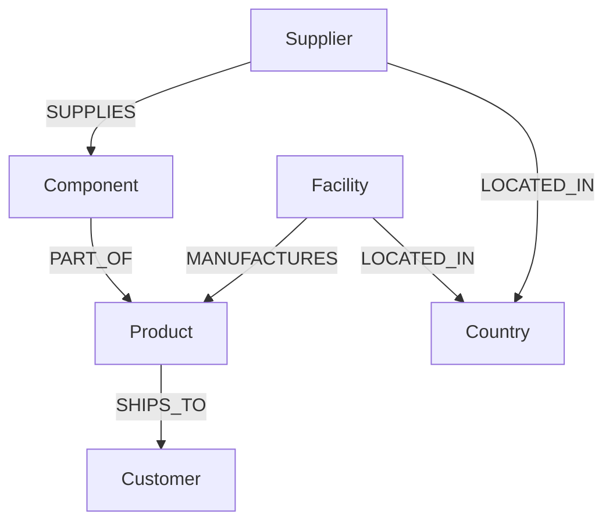
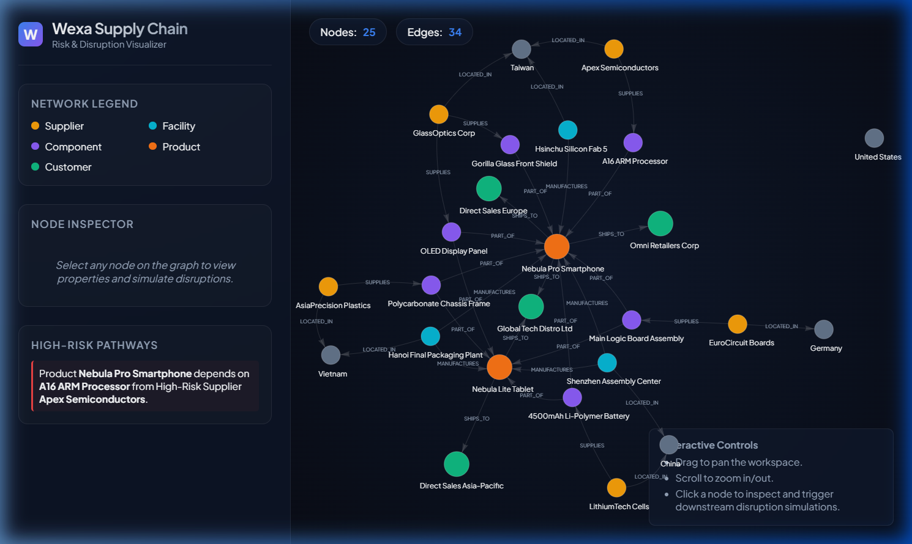
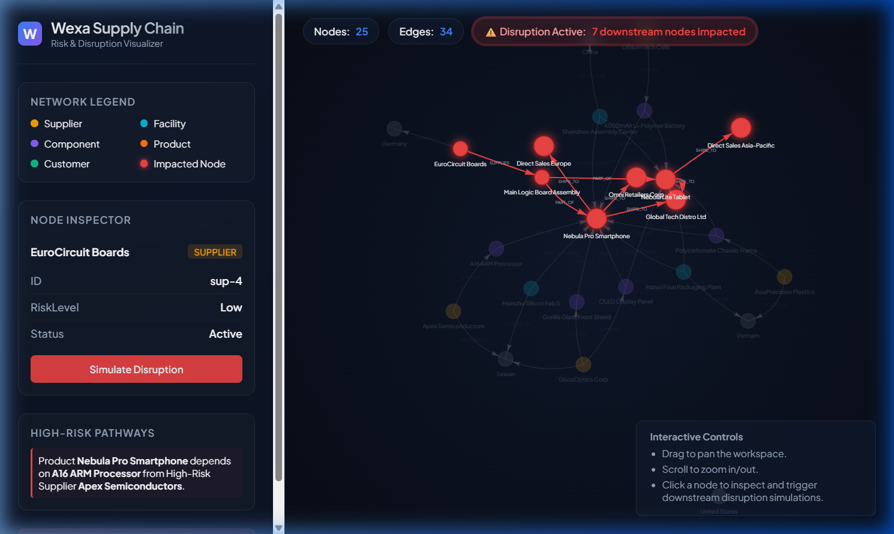

# Wexa Supply Chain — Risk & Disruption Tracker

A full-stack, interactive graph database application built with **Vite (React)** and **Express (Node.js)**, backed by **CognoDB**. 

This application simulates a global electronics supply chain, enabling managers to simulate disruptions at any node (e.g., factories, suppliers) and visualize how the impact propagates downstream to components, products, and customer accounts.

---

## Why a Graph Database?
In supply chain management, data is naturally structured as a deep, hierarchical network (e.g., *Suppliers* supply *Components*, which are part of *Products*, which ship to *Customers*).

In a relational database (SQL), analyzing risk propagation requires complex recursive queries or multiple table joins, which become extremely slow and complicated as the number of tiers (hops) increases. 

### Graph Database Advantages:
- **Expressive Multi-Hop Traversals**: The key query traces all downstream dependencies up to 5 tiers deep. In openCypher, this is written in a single simple line: `MATCH (origin)-[:SUPPLIES|PART_OF|SHIPS_TO|MANUFACTURES*1..5]->(affected)`.
- **Flexible Schema**: Real-world supply chains shift constantly. Adding new node types (like warehouses, logistics hubs) or relationship types requires no migration steps.
- **Natural Modeling**: The database graph mirrors the physical supply chain layout, making queries intuitive and lightning-fast.

---

## Data Model Diagram



---

## Core openCypher Queries

### 1. Retrieve Entire Network Topology
Fetches all nodes and relationships to render the initial interactive canvas:
```cypher
MATCH (n)
OPTIONAL MATCH (n)-[r]->(m)
RETURN n, r, m
LIMIT 150
```

### 2. Downstream Risk Propagation (Multi-Hop Traversal)
Identifies every single downstream element affected if a specific node experiences a disruption:
```cypher
MATCH path = (origin)-[:SUPPLIES|PART_OF|SHIPS_TO|MANUFACTURES*1..5]->(affected)
WHERE origin.id = $originId
RETURN path
```

### 3. Identify High-Risk Paths
Finds products reliant on components supplied by high-risk suppliers:
```cypher
MATCH (s:Supplier {riskLevel: 'High'})-[:SUPPLIES]->(c:Component)-[:PART_OF]->(p:Product)
RETURN s.name AS supplier, c.name AS component, p.name AS product
```

---

## Setup & Running the Project

### Prerequisites
- Node.js installed (v16+)
- A CognoDB Cloud instance from [console.cognodb.com](https://console.cognodb.com)

### 1. Setup Environment Variables
Create a file named `.env` inside the `backend` directory and add your CognoDB connection credentials:
```env
COGNODB_URI=bolt+s://db-YOUR_ID.databases.cognodb.com
COGNODB_USER=cognodb
COGNODB_PASSWORD=YOUR_PASSWORD
PORT=5000
```

### 2. Install Dependencies
Run the following command in the root project folder:
```bash
npm run install:all
```

### 3. Seed the Database
Populate your database with the supply chain network data:
```bash
npm run seed
```

### 4. Start the Application
Open two separate terminal windows:

- **Terminal 1 (Backend Server)**:
  ```bash
  npm run backend
  ```
- **Terminal 2 (Frontend Client)**:
  ```bash
  npm run frontend
  ```

Once started, navigate to `http://localhost:3000` in your web browser.

---

## UI Features
- **Interactive Graph Canvas**: Drag, zoom, and select nodes to trace connections.
- **Dynamic Disruption Simulation**: Select a Supplier or Facility, click **Simulate Disruption**, and see the downstream path highlight in **red** while unrelated nodes fade out.
- **Live KPI Badges**: Shows the count of total nodes, relationships, and active impacted nodes in real-time.
- **Risk Pathway Indicator**: Sidebar widget flagging products containing parts from critical/high-risk suppliers.

---

## Screenshots

### 1. Global Supply Chain Network Canvas (Initial State)


### 2. Disruption Propagation Simulation


